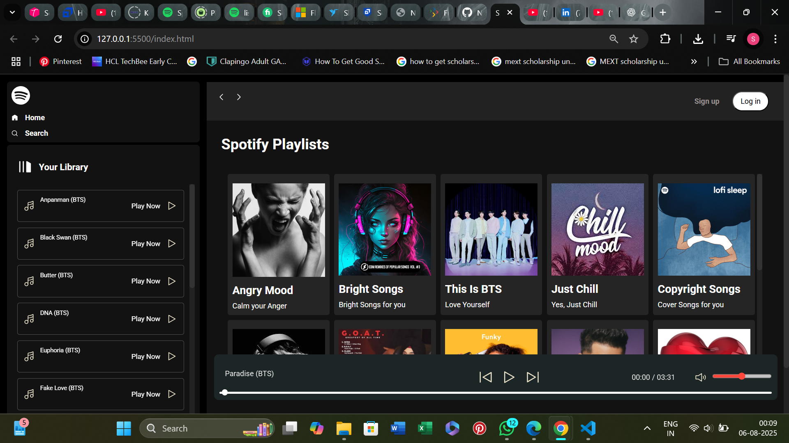

# Spotify Clone 🎵

A responsive Spotify landing page clone built using **HTML**, **CSS**, and a bit of **JavaScript** (if added).  
Designed to mimic the look and feel of the official Spotify web player.

## 🚀 Features
- Modern UI with dark mode theme
- Responsive layout for desktop
- Playlist and navigation sidebar

## 🛠️ Tech Stack
- HTML5
- CSS3 / Tailwind CSS (if used)
- JavaScript (optional)

## 📸 Preview

## 📁 Project Structure
📦 Spotify Clone
┣ 📁 img
┃ ┗ 📄 playlist.svg
┣ 📄 index.html
┣ 📄 style.css
┣ 📄 script.js (if used)
┗ 📄 README.md

---

## 📌 How to Run
1. Download or clone this repository.
2. Open `index.html` in your browser.

---

### 🙌 Connect with me
**Shagun Pal**  
📍 Learning Node.js | Exploring Frontend & Backend Development

---

### 🌐 Live Demo (Optional)
If you'd like, I can help you host this using **GitHub Pages** for free!
